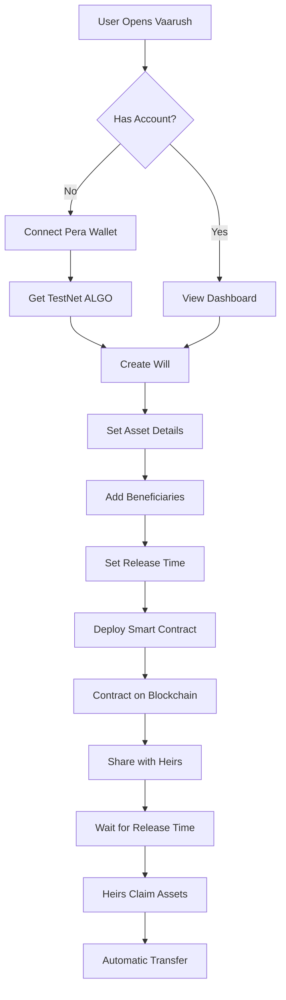

<div align="center">

# 🔐 **VAARUSH 2.0**

### Smart Inheritance Made Simple with AI & Blockchain

*Empowering families with AI-guided digital inheritance and Algorand-verified asset transfer.*


[🚀 Live Demo](#-quick-start) • [📖 Documentation](#-documentation) • [🎯 Features](#-core-features) • [🏗️ Architecture](#-technical-architecture) • [🤝 Contributing](#-contributing)

---

</div>

## 🌟 **Overview**

**Vaarush 2.0** revolutionizes digital inheritance by integrating **Algorand blockchain** with **AI-powered guidance** to create **time-locked smart contracts** that automatically transfer assets to verified heirs. No lawyers. No delays. No fraud.

Traditional inheritance is broken:
- ❌ Months of legal battles
- ❌ High attorney fees
- ❌ Risk of document fraud
- ❌ Family disputes over assets
- ❌ Confusion and stress

**Vaarush 2.0 solves this:**
- ✅ Instant blockchain deployment
- ✅ Minimal transaction costs
- ✅ Tamper-proof smart contracts
- ✅ Transparent asset distribution
- ✅ AI assistant in local languages

---

## 🎯 **Vision**

> *To make inheritance **easy, transparent, and secure** for every family through technology that guides and protects them.*

**Vaarush** bridges the gap between **traditional legal wills** and **blockchain automation**, ensuring:
- 🔒 **Security**: Immutable smart contracts on Algorand
- 🤖 **Guidance**: AI assistant for step-by-step help
- ⏰ **Automation**: Time-triggered asset transfers
- 📜 **Compliance**: Continuous regional law updates
- 🌐 **Accessibility**: Multi-language support

---

## ✨ **Core Features**

<table>
<tr>
<td width="33%" valign="top">

### 🔗 **Blockchain-Verified Wills**
Issues Algorand smart contracts representing legally binding, tamper-proof digital wills.

**Tech:** PyTeal, Algorand SDK

</td>
<td width="33%" valign="top">

### 🤖 **AI Assistant**
Multilingual AI guide that helps users through will creation, answers questions, and sends reminders.

**Tech:** NLP, FastAPI

</td>
<td width="33%" valign="top">

### ⏱️ **Time-Locked Transfers**
Smart contracts automatically release assets to heirs when specified conditions are met.

**Tech:** Algorand Smart Contracts

</td>
</tr>

<tr>
<td width="33%" valign="top">

### 📊 **Transparent Dashboard**
Real-time view of all created wills, beneficiaries, and blockchain verification links.

**Tech:** React, TypeScript

</td>
<td width="33%" valign="top">

### 📜 **Legal Compliance**
Continuous updates to match regional inheritance laws across jurisdictions.

**Tech:** Machine Learning, Legal APIs

</td>
<td width="33%" valign="top">

### 🔐 **Zero-Knowledge Security**
End-to-end encryption ensures only authorized parties access sensitive data.

**Tech:** Encryption, Blockchain

</td>
</tr>
</table>

---

## 🏗️ **Technical Architecture**

```
┌─────────────────────────────────────────────────────────────────┐
│                        VAARUSH 2.0 STACK                        │
├─────────────────────────────────────────────────────────────────┤
│                                                                 │
│  ┌─────────────────┐  ┌──────────────────┐  ┌───────────────┐ │
│  │   FRONTEND      │  │    BACKEND       │  │   BLOCKCHAIN  │ │
│  │                 │  │                  │  │               │ │
│  │  React 18       │◄─┤  Python 3.11     │◄─┤  Algorand     │ │
│  │  TypeScript     │  │  FastAPI         │  │  TestNet      │ │
│  │  React Router   │  │  Pydantic        │  │               │ │
│  │  CSS3           │  │  SQLAlchemy      │  │  PyTeal v8    │ │
│  │                 │  │                  │  │  AlgoSDK 3.1  │ │
│  └─────────────────┘  └──────────────────┘  └───────────────┘ │
│           │                    │                     │          │
│           └────────────────────┴─────────────────────┘          │
│                              │                                  │
│                   ┌──────────▼──────────┐                       │
│                   │   SMART CONTRACTS   │                       │
│                   │                     │                       │
│                   │  • Approval (TEAL)  │                       │
│                   │  • Clear State      │                       │
│                   │  • Time Validation  │                       │
│                   │  • Heir Management  │                       │
│                   │  • Asset Transfer   │                       │
│                   └─────────────────────┘                       │
│                                                                 │
└─────────────────────────────────────────────────────────────────┘
```

---

## 🚀 **Quick Start**

### **Prerequisites**

```bash
Node.js >= 18.x
Python >= 3.11
Git
Algorand TestNet Account (Pera Wallet)
```

### **Installation**

```bash
# Clone the repository
git clone https://github.com/yourusername/vaarush.git
cd vaarush

# Install frontend dependencies
cd frontend
npm install

# Install backend dependencies
cd ../
python -m venv .venv
source .venv/bin/activate  # On Windows: .venv\Scripts\activate
pip install -r requirements.txt

# Compile smart contracts
cd contracts
python digital_will.py
```

### **Configuration**

Create `.env` file:

```env
# Algorand Configuration
ALGOD_ADDRESS=https://testnet-api.algonode.cloud
ALGOD_TOKEN=
NETWORK=testnet

# Application
PORT=3000
API_PORT=8000
```

### **Run the Application**

```bash
# Terminal 1: Start Frontend
cd frontend
npm start

# Terminal 2: Start Backend
cd backend
uvicorn main:app --reload

# Open browser at http://localhost:3000
```

---

## 🔗 **Algorand Blockchain Integration**

### **Deployed Smart Contract**

```
App ID: 748564269
Network: Algorand TestNet
Explorer: https://testnet.algoexplorer.io/application/748564269
```

### **Smart Contract Features**

| Feature | Description | Technology |
|---------|-------------|------------|
| 🔐 **Time-Locked Release** | Assets unlock only after specified timestamp | PyTeal Conditional Logic |
| 👥 **Multi-Heir Support** | Distribute assets among multiple beneficiaries | Global State Management |
| 🔍 **Transparent Verification** | All transactions visible on blockchain | Algorand Explorer |
| ⛔ **Immutable Records** | Once deployed, will cannot be tampered | Blockchain Immutability |
| 🚨 **Claim Validation** | Only authorized heirs can trigger transfers | Application Call Logic |

### **Contract Structure**

```python
# Approval Program (PyTeal)
def approval_program():
    owner_key = Bytes("owner")
    asset_id_key = Bytes("asset_id")
    release_time_key = Bytes("release_time")
    is_claimed_key = Bytes("is_claimed")
    
    # Time-based validation
    can_claim = And(
        Global.latest_timestamp() >= App.globalGet(release_time_key),
        App.globalGet(is_claimed_key) == Int(0)
    )
    
    # Claim logic
    on_claim = Seq([
        Assert(can_claim),
        App.globalPut(is_claimed_key, Int(1)),
        Return(Int(1))
    ])
```

---

## 🗺️ **User Journey**



### **Step-by-Step Process**

1. **Connect Wallet** → Link Pera Wallet or AlgoSigner
2. **Create Will** → Fill in asset details, heirs, release date
3. **Deploy Contract** → Smart contract deployed to Algorand TestNet
4. **Verify on Chain** → Check contract on AlgoExplorer
5. **Share Info** → Send contract ID to beneficiaries
6. **Automated Release** → Assets transfer when time conditions met

---

## 🧠 **AI Assistant Integration**

### **Capabilities**

- 🗣️ **Multilingual Support**: English, Hindi, Telugu, Tamil, etc.
- 💬 **Natural Language Processing**: Understands user intent
- 📧 **Automated Reminders**: WhatsApp, SMS, Email notifications
- 📚 **Knowledge Base**: Answers legal and technical questions
- 🎯 **Guided Workflows**: Step-by-step will creation

### **Example Interactions**

```
User: "How do I create a will?"
AI: "I'll guide you through creating a digital will in 5 simple steps..."

User: "When can my heirs claim?"
AI: "Your heirs can claim assets on [DATE] at [TIME]. The smart contract 
will automatically enable the claim function."

User: "Is this legally valid?"
AI: "Vaarush smart contracts work alongside traditional legal wills. We 
recommend maintaining a legal will while using our platform for automated 
execution."
```

---

## 📊 **Dashboard Features**

### **Overview Panel**

| Metric | Description |
|--------|-------------|
| 📜 Total Wills | Number of smart contracts deployed |
| 👥 Beneficiaries | Total heirs across all wills |
| 💰 Total Assets | Sum of all assets under management |
| ⏰ Pending Claims | Wills with release date reached |
| ✅ Completed | Successfully claimed inheritances |

### **Will Card Information**

Each will displays:
- 🆔 Will ID
- 🔗 Smart Contract Address
- 💎 Asset Type & ID
- 📅 Release Date/Time
- 👨‍👩‍👧 Number of Heirs
- 🔍 Blockchain Explorer Link
- 📊 Status (Active/Pending/Claimed)

---

## 🎨 **Screenshots**

<details>
<summary><b>🏠 Homepage</b></summary>

- Clean, modern interface
- Live API connection status
- Navigation to Create Will & Dashboard
- Real-time blockchain sync indicator

</details>

<details>
<summary><b>📝 Create Will Page</b></summary>

- Asset selection (ALGO or ASAs)
- Date/Time picker with validation
- Dynamic heir addition/removal
- Share percentage calculator
- Instant smart contract deployment

</details>

<details>
<summary><b>📊 Dashboard</b></summary>

- Grid view of all wills
- Quick access to blockchain explorer
- Status indicators
- Claim progress tracking

</details>

---

## 🛠️ **Development**

### **Project Structure**

```
vaarush/
├── frontend/               # React application
│   ├── public/
│   ├── src/
│   │   ├── components/     # Reusable components
│   │   ├── pages/          # Page components
│   │   ├── styles/         # CSS files
│   │   └── App.tsx         # Main app component
│   └── package.json
│
├── backend/                # FastAPI backend (future)
│   ├── api/
│   ├── models/
│   ├── services/
│   └── main.py
│
├── contracts/              # PyTeal smart contracts
│   ├── digital_will.py     # Contract definition
│   ├── deploy_simple.py    # Deployment script
│   └── claim_will.py       # Claim script
│
└── docs/                   # Documentation
    ├── ARCHITECTURE.md
    ├── API.md
    └── DEPLOYMENT.md
```

### **Key Technologies**

| Layer | Technology | Purpose |
|-------|------------|---------|
| **Frontend** | React 18 + TypeScript | UI/UX and state management |
| **Smart Contracts** | PyTeal v8 | Algorand contract logic |
| **Blockchain** | Algorand SDK 3.1.2 | Blockchain interaction |
| **Backend (Planned)** | FastAPI + Python | API and business logic |
| **Database (Planned)** | PostgreSQL | User data persistence |
| **AI (Planned)** | OpenAI API | Intelligent assistant |

---

## 🔐 **Security**

### **Blockchain Security**

- ✅ **Immutable Contracts**: Deployed contracts cannot be altered
- ✅ **Time Validation**: Release time enforced by blockchain timestamp
- ✅ **Access Control**: Only authorized heirs can claim
- ✅ **Transparent Auditing**: All transactions publicly verifiable

### **Application Security**

- 🔒 **Wallet Authentication**: Pera Wallet / AlgoSigner integration
- 🔐 **Private Key Security**: Keys never leave user's wallet
- 🛡️ **HTTPS Only**: Encrypted communication
- 🔍 **Input Validation**: Sanitized user inputs

---

## 📖 **Documentation**

### **User Guides**

- [📘 Getting Started](docs/getting-started.md)
- [📝 Creating Your First Will](docs/create-will.md)
- [👥 Managing Beneficiaries](docs/manage-heirs.md)
- [💸 Claiming Inheritance](docs/claim-guide.md)
- [🔍 Blockchain Verification](docs/verification.md)

### **Developer Guides**

- [🏗️ Architecture Overview](docs/architecture.md)
- [🔧 API Reference](docs/api.md)
- [🚀 Deployment Guide](docs/deployment.md)
- [🧪 Testing Guide](docs/testing.md)
- [🤝 Contributing Guidelines](docs/contributing.md)

---

## 🧪 **Testing**

### **Run Tests**

```bash
# Frontend tests
cd frontend
npm test

# Smart contract tests (future)
cd contracts
pytest test_contracts.py

# Integration tests
npm run test:integration
```

### **Verify Smart Contract**

```bash
# Check contract on TestNet
goal app info --app-id 748564269

# Test claim functionality
python contracts/claim_will.py
```

---

## 🌍 **Roadmap**

### **Phase 1: MVP** ✅ (Complete)
- [x] React frontend with TypeScript
- [x] PyTeal smart contract
- [x] Algorand TestNet deployment
- [x] Basic dashboard
- [x] Will creation & viewing

### **Phase 2: Enhancement** 🔄 (In Progress)
- [ ] FastAPI backend
- [ ] User authentication
- [ ] Database integration
- [ ] Email notifications
- [ ] Multi-asset support (ASAs, NFTs)

### **Phase 3: AI Integration** 📅 (Planned)
- [ ] AI assistant chatbot
- [ ] NLP in local languages
- [ ] WhatsApp/SMS integration
- [ ] Legal document verification
- [ ] Automated compliance checks

### **Phase 4: Scale** 🚀 (Future)
- [ ] MainNet deployment
- [ ] Partnership with law firms
- [ ] Integration with national ID systems
- [ ] Global expansion
- [ ] Mobile apps (iOS/Android)

---

## 🤝 **Contributing**

We welcome contributions! Please follow these steps:

1. **Fork the repository**
2. **Create a feature branch**: `git checkout -b feature/amazing-feature`
3. **Commit changes**: `git commit -m 'Add amazing feature'`
4. **Push to branch**: `git push origin feature/amazing-feature`
5. **Open a Pull Request**

### **Contribution Guidelines**

- Follow existing code style
- Write clear commit messages
- Add tests for new features
- Update documentation
- Ensure all tests pass

---

## 📄 **License**

This project is licensed under the **MIT License** - see the [LICENSE](LICENSE) file for details.

---

## 👨‍💻 **Author**

**Shashank Dumpala**  
CSE (AI/ML) Student | Blockchain Developer | Open Source Enthusiast

- 🌐 Website: [vaarush.io](https://vaarush.io)
- 📧 Email: shashankdumpala6@gmail.com
- 📱 Phone: +91 9866028891
- 💼 LinkedIn: [linkedin.com/in/shashankdumpala](https://linkedin.com/in/shashankdumpala)
- 🐙 GitHub: [@shashankdumpala](https://github.com/shashankdumpala)

---

## 🙏 **Acknowledgments**

- **Algorand Foundation** - For blockchain infrastructure
- **PyTeal Team** - For smart contract framework
- **React Community** - For frontend libraries
- **Open Source Contributors** - For inspiration and tools

---

## 📞 **Support**

Need help? We're here for you:

- 📧 **Email**: support@vaarush.io
- 💬 **Discord**: [Join our server](https://discord.gg/vaarush)
- 📖 **Docs**: [docs.vaarush.io](https://docs.vaarush.io)
- 🐛 **Issues**: [GitHub Issues](https://github.com/yourusername/vaarush/issues)

---

<div align="center">

### **Built with ❤️ for families everywhere**

**Vaarush 2.0** - *Where tradition meets technology*


---

**Star ⭐ this repo if you find it helpful!**

</div>